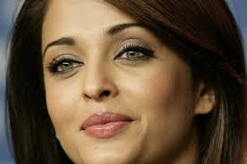

# MATLAB Image Processing Toolkit



A comprehensive collection of MATLAB scripts for various computer vision and image processing tasks, including face detection, character recognition, feature extraction, and image analysis.

## 🎯 Features

### Computer Vision Algorithms
- **Face Detection (FD.m)** - Automatic face detection using cascade object detector with feature point extraction
- **Character Recognition (findCharacter.m)** - Locate and identify characters in images using normalized cross-correlation
- **Alphabet Recognition (Alphabetrecognition.m)** - Match alphabet templates in text images
- **Cross-Correlation Analysis (CC.m, NXCorr.m)** - Image similarity and pattern matching

### Feature Extraction
- **HOG Features (HOG.m, hog_representation.m)** - Histogram of Oriented Gradients for object detection
- **SURF Features** - Speeded-Up Robust Features detection for keypoint matching
- **Region Properties (regprops.m)** - Extract properties from image regions

### Image Processing
- **Filtering (Filter.m, ConvolvingPSF.m)** - Image convolution and point spread function operations
- **Test Scripts (test3.m, test4.m)** - Various image processing experiments

## 📋 Requirements

- MATLAB R2015a or later
- Image Processing Toolbox
- Computer Vision Toolbox (for face detection and feature extraction)

## 🚀 Quick Start

### Face Detection Example
```matlab
% Run the face detection script
FD

% The script will:
% 1. Load an image
% 2. Detect faces using cascade detector
% 3. Draw bounding boxes around detected faces
% 4. Extract and display feature points
```

### Character Recognition Example
```matlab
% Find specific characters in an image
found = findCharacter()

% Adjust the character template in the function
% Modify accuracy threshold (default: 0.98)
```

### Alphabet Recognition Example
```matlab
% Match alphabet templates using cross-correlation
Alphabetrecognition

% Visualizes correlation surface
% Returns number of matches above threshold (0.95)
```

## 📁 Project Structure

```
matlab-image-processing/
├── scripts/              # MATLAB script files
│   ├── FD.m             # Face detection
│   ├── findCharacter.m  # Character recognition
│   ├── HOG.m            # HOG feature extraction
│   ├── CC.m             # Cross-correlation
│   └── ...              # Other scripts
├── images/              # Test images and samples
│   ├── AR.jpg           # Sample images
│   ├── A.png            # Template images
│   └── ...
├── docs/                # Documentation and papers
│   ├── OCR.pdf          # OCR documentation
│   └── ...
├── fonts/               # Font files for text rendering
└── README.md            # This file
```

## 🔬 Key Algorithms

### 1. Face Detection (FD.m)
Uses Viola-Jones cascade object detector to identify faces in images and extracts MinEigen features for tracking.

### 2. Character Recognition (findCharacter.m)
Implements template matching with normalized cross-correlation to find specific characters in text images:
- Converts images to double precision
- Performs sliding window correlation
- Applies threshold-based detection (98% accuracy)
- Highlights found characters with bounding boxes

### 3. SURF Feature Detection (HOG.m)
Detects and visualizes SURF (Speeded-Up Robust Features) keypoints for:
- Image registration
- Object recognition
- Feature matching

## 📊 Sample Images Included

- `AR.jpg` - Sample image for face detection
- `A.png`, `abc.png` - Template images for character recognition
- `1.jpg`, `2.jpg`, `3.jpg`, `4.jpg` - Test images
- `control.jpg` - Control image for feature matching
- `circle.jpg`, `camman.jpg` - Various test samples

## 📖 Documentation

- `OCR.pdf` / `OCR.doc` - Optical Character Recognition documentation
- `1-s2.0-S1877050915023534-main.pdf` - Research paper reference
- `lec1.pptx` - Lecture presentation on image processing

## 🛠️ Usage Tips

1. **Adjust Image Paths**: Update file paths in scripts to point to your images
2. **Tune Thresholds**: Modify correlation thresholds for better detection accuracy
3. **Experiment**: Try different images and parameters to see algorithm behavior
4. **GPU Acceleration**: Enable GPU computation for faster processing on large images

## 📝 Example Workflow

```matlab
% 1. Load and preprocess image
I = imread('your_image.jpg');
I_gray = rgb2gray(I);

% 2. Detect features
features = detectSURFFeatures(I_gray);

% 3. Visualize results
imshow(I); hold on;
plot(features.selectStrongest(50));
```

## ⚙️ Configuration

Most scripts can be configured by modifying:
- **Input image paths** - Change `imread('filename')` to your image
- **Detection thresholds** - Adjust correlation values (typically 0.95-0.99)
- **Feature parameters** - Modify detector settings for different sensitivities

## 🤝 Contributing

This is an educational repository showcasing various image processing techniques. Feel free to:
- Fork and experiment with the code
- Add new algorithms and techniques
- Improve documentation
- Report issues or suggest improvements

## 📄 License

This project is licensed under the Apache License 2.0 - see the [LICENSE](LICENSE) file for details.

## 🔍 Research & References

This repository includes implementations based on computer vision research. See included PDF documents for theoretical background and algorithmic details.

---

**Note**: This toolkit is designed for educational purposes and research. For production applications, consider optimization and error handling enhancements.

**Last Updated**: January 2026
